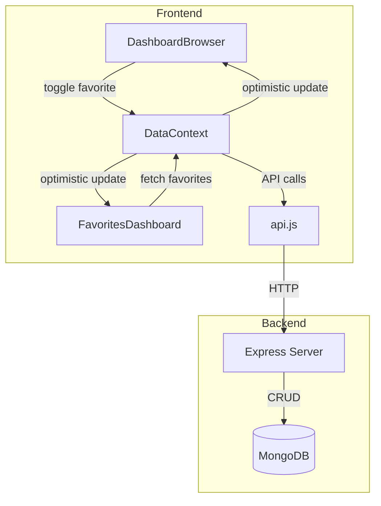

# Design Document: Dashboard Favorites API

## Overview

This design implements a favorites system that persists user dashboard preferences to a MongoDB database via REST API calls. The system replaces the current localStorage-based approach with server-side persistence, enabling favorites to sync across devices and sessions.

The implementation follows an optimistic UI pattern where the interface updates immediately on user interaction, then reconciles with the server response, rolling back if the request fails.

## Architecture



## Components and Interfaces

### API Endpoints

The following endpoints will be called from the frontend:

| Method | Endpoint | Description | Request Body | Response |
|--------|----------|-------------|--------------|----------|
| GET | `/favorites` | Fetch user's favorite dashboards | - | `{ favorites: Dashboard[] }` |
| POST | `/favorites` | Add dashboard to favorites | `{ dashboardId: string }` | `{ success: boolean, favorites: string[] }` |
| DELETE | `/favorites/:dashboardId` | Remove dashboard from favorites | - | `{ success: boolean, favorites: string[] }` |

### API Functions (src/lib/api.js)

```javascript
// Add to existing api.js

// Fetch user's favorite dashboards
export const getFavorites = () => api.get('/favorites');

// Add a dashboard to favorites
export const addFavorite = (dashboardId) => 
  api.post('/favorites', { dashboardId });

// Remove a dashboard from favorites
export const removeFavorite = (dashboardId) => 
  api.delete(`/favorites/${dashboardId}`);
```

### DataContext Updates

The DataContext will be enhanced to:
1. Store favorites state from the database
2. Provide async functions for toggling favorites with optimistic updates
3. Handle loading and error states

```javascript
// Enhanced DataContext state
{
  favorites: string[],           // Array of dashboard IDs
  favoritesLoading: boolean,     // Loading state for fetch
  favoritesError: string | null, // Error message if any
  toggleFavoriteAsync: (dashboardId: string) => Promise<void>,
  fetchFavorites: () => Promise<void>
}
```

### Component Updates

#### DashboardBrowser.jsx
- Replace `toggleFavorite` with `toggleFavoriteAsync`
- Add loading state to heart icon button
- Handle optimistic updates and rollback

#### FavoritesDashboard.jsx
- Call `fetchFavorites` on component mount
- Display loading state while fetching
- Display error state if fetch fails
- Use favorites from DataContext instead of local filtering

## Data Models

### Favorites State Model

```javascript
{
  favorites: string[],        // Array of dashboard ObjectIds
  favoritesLoading: boolean,  // True while API request in progress
  togglingId: string | null,  // Dashboard ID currently being toggled
  error: string | null        // Error message from last failed request
}
```

### API Response Models

```javascript
// GET /favorites response
{
  favorites: [
    {
      _id: string,
      title: string,
      description: string,
      embedUrl: string,
      department: string,
      createdBy: { _id: string, name: string },
      company: { _id: string, name: string },
      createdAt: string,
      updatedAt: string
    }
  ]
}

// POST /favorites response
{
  success: boolean,
  message: string,
  favorites: string[]  // Updated list of favorite IDs
}

// DELETE /favorites/:id response
{
  success: boolean,
  message: string,
  favorites: string[]  // Updated list of favorite IDs
}
```

## Correctness Properties

*A property is a characteristic or behavior that should hold true across all valid executions of a system—essentially, a formal statement about what the system should do. Properties serve as the bridge between human-readable specifications and machine-verifiable correctness guarantees.*

### Property 1: Toggle Favorite API Call

*For any* dashboard and any user action (add or remove), clicking the heart icon SHALL trigger the appropriate API call (POST for add, DELETE for remove) with the correct dashboard ID.

**Validates: Requirements 1.1, 2.1**

### Property 2: UI State Reflects Favorite Status

*For any* dashboard, after a successful API response, the heart icon state (filled/unfilled) SHALL match whether the dashboard ID is in the favorites array.

**Validates: Requirements 1.2, 2.2**

### Property 3: Rollback on API Failure

*For any* toggle operation that fails, the UI state SHALL revert to the state before the toggle was initiated, and the favorites array SHALL remain unchanged.

**Validates: Requirements 1.4, 2.4, 5.2**

### Property 4: Favorites List Rendering

*For any* list of favorite dashboards returned from the API, the Favorites_Dashboard SHALL render exactly those dashboards (no more, no less).

**Validates: Requirements 3.3**

### Property 5: Cross-Component State Sync

*For any* favorites state change (add or remove), both Dashboard_Browser and Favorites_Dashboard SHALL reflect the same favorites state when rendered.

**Validates: Requirements 4.1, 4.2, 4.3**

### Property 6: Optimistic Update Timing

*For any* toggle action, the UI SHALL update before the API response is received, and the button SHALL be disabled until the request completes.

**Validates: Requirements 5.1, 5.3**

## Error Handling

| Scenario | Handling |
|----------|----------|
| Network error on toggle | Revert optimistic update, show error toast |
| Network error on fetch | Show error message, offer retry button |
| 401 Unauthorized | Redirect to login (handled by api.js interceptor) |
| 404 Dashboard not found | Show error toast, remove from local state |
| 500 Server error | Show generic error toast, revert state |

## Testing Strategy

### Unit Tests
- Test API functions return correct promises
- Test DataContext state updates correctly
- Test error handling paths

### Property-Based Tests
Using a property-based testing library (e.g., fast-check), we will validate:
- Property 1: Toggle operations call correct API endpoints
- Property 2: UI state consistency with favorites array
- Property 3: Rollback behavior on failures
- Property 4: Rendering matches API response
- Property 5: State synchronization across components
- Property 6: Optimistic update behavior

Each property test will run minimum 100 iterations to ensure coverage across various input combinations.

### Integration Tests
- Test full flow: click heart → API call → UI update
- Test error scenarios with mocked API failures
- Test navigation between components maintains state
